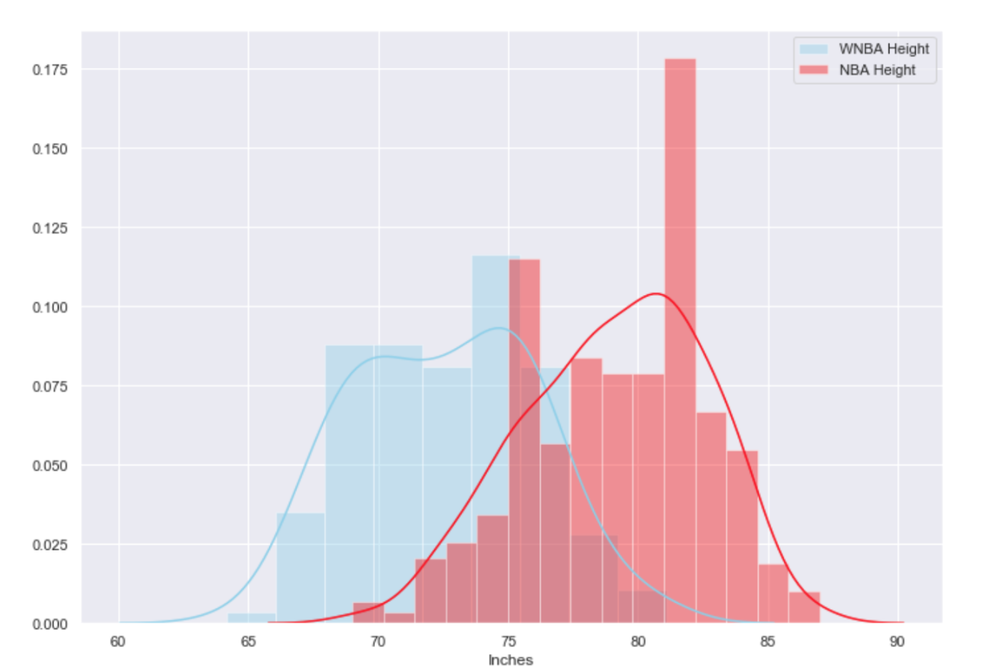
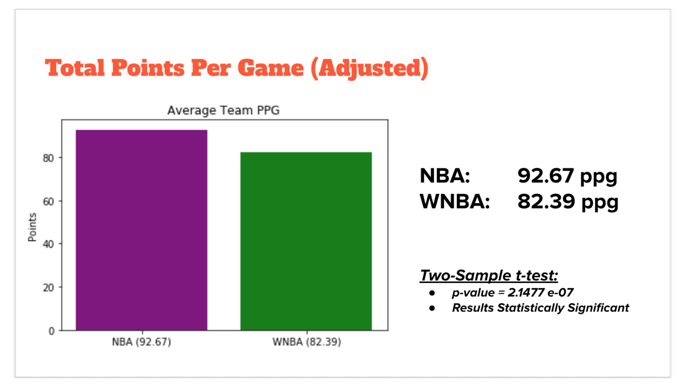
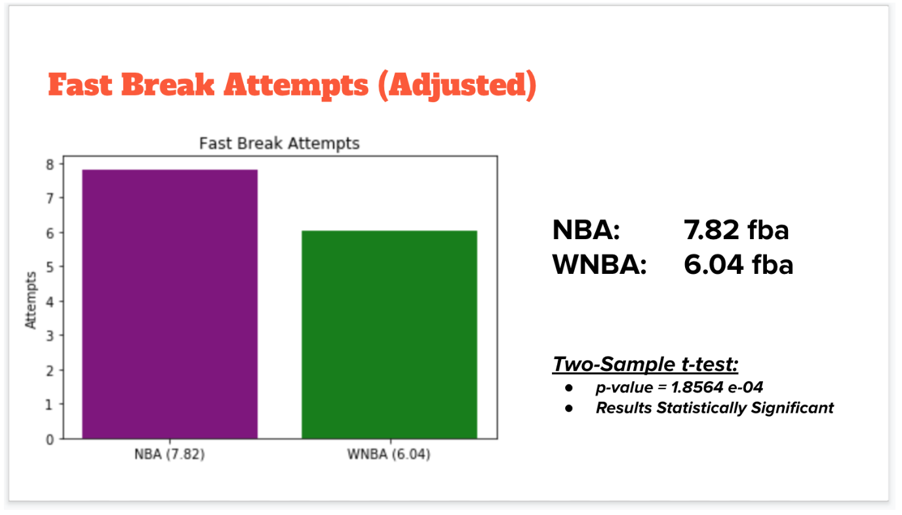
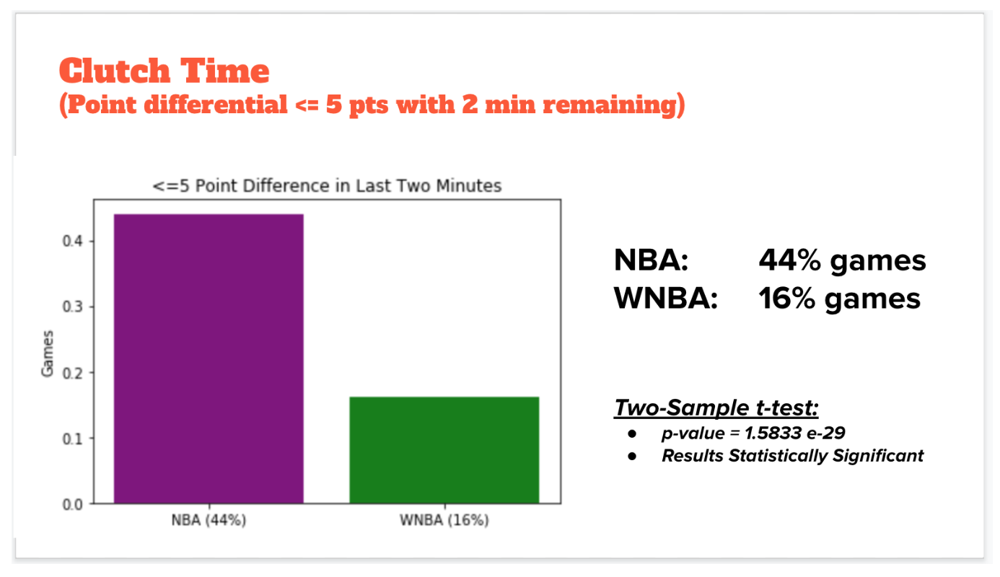
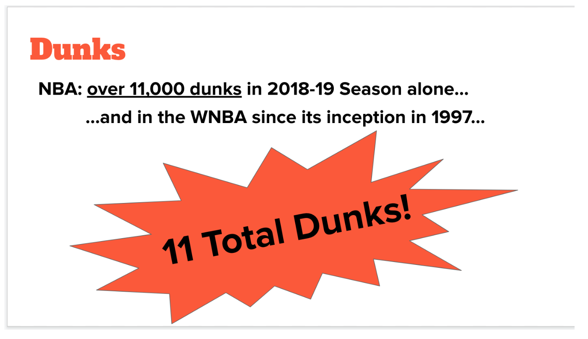

  <b>Is there a statistically significant difference in scoring in the NBA vs. the WNBA? </b>

Everyone knows that one of the things that makes basketball so exciting to watch are dunks and alley-oops. With this  
knowledge, one of my data science bootcamp cohort mates and I decided to do a presentation on the rim height in the NBA and 
WNBA and whether or not it should be lowered for the WNBA. As my partner B.G. Lemmon put it — “ in other 
sports that both men and women play, volleyball nets are lowered by about 7 inches for women, the tee boxes 
in golf are moved up significantly for women, and in tennis women play fewer sets than the men do at Grand Slams. 
So clearly there is a precedent for having sports adjusted to account for the physiological differences in men 
and women.”¹

We had determined that the average height of the women in the WNBA was 72.57 inches for 
the 2016–17 season and 79.10 inches for the men in the NBA, a difference of 6.53 inches.

We went on to further calculate how high the average basketball player can jump by using standing reach, which 
a HoopsBeast study shows to be 1.33x their normal height, and vertical jump. Based on these calculations, 
how high the average NBA or WNBA player can jump would be calculated as follows:

  <b>Player Reach = (standing reach *average height) + vertical jump
</b>

  <b>NBA Player Reach = (1.33 * 79.09 in.) + 28.1 in. ≈ 133.3 inches
</b>

  <b>WNBA Player Reach = (1.33 * 72.57 in.) + 19.0 in. ≈115.5 inches
</b>

The rim in both the NBA and WNBA is 120 inches (10 feet), and in order to dunk, your fingers need to be about 6 inches 
above the rim². This requires a reach of about 126 inches. The men naturally meet this vertical jump but the women come 
about 10 inches short.

To look at this through a different lens, if the men were playing at a similar height disadvantage than the women 
are playing at, they would be playing on a 11.5 foot rim (≈138.5 in):

  <b>NBA Rim Equivalent = (133.3 in. * 120) / 115.5 in. ≈138.5 in. </b>

And the women should be playing on a rim of about 8 feet, 8 inches:

  <b>WNBA Rim Equivalent = (115.5 in.*120 in.) / 133.2 in. ≈ 104 inches²</b>

Are there actual statistically significant differences in scoring between the NBA and WNBA? 
B.G. and I wanted to explore what we considered “excitement metrics” — high scoring games, 3-pt attempts, fast breaks, clutch 
time play and dunks.
 
By scraping nba.com, wnba.com and using the sportrader API, we were able to find all of the relevant stats for these metrics
and build custom datasets. We then used the datasets to compare the NBA and WNBA to see how they measured up to each other in terms of what we consider make for an exciting game.

So lets take a look at these metrics…

Since an NBA game is 48 minutes verses 40 minutes for a WNBA game we needed to adjust the data.
After adjustment, you can see that the NBA **outscores** the WNBA by about 10–11 points per 40 minutes — about 93 points 
to 82 points.

Running a two sample t-test shows a very low p-value which means that these results are statistically significant — 
that it is not just chance that the men score more than the women but that there is a reason that the men are 
scoring more than the women.

In **3 point attempts** — the NBA attempts 3 point shots approximately 27 times per 40 minutes to 19 times per game for the women.
Again, running a two sample t-test shows a very low p-value which, again, means that these results are statistically significant.

A **fast break** is when a team attempts to move the ball up court and into scoring position as quickly as possible, so that 
the defense is outnumbered and does not have time to set up.

The NBA is at around 8 fast breaks per 40 minutes, while the WNBA is at 6.
Running a two sample t-test again shows a very low p-value which means that these results are statistically significant.

And here we are looking at **clutch time**, which we defined as the last 2 minutes of a game with a score differential of 5 points or less.
To us, this is one of the most exciting parts of the game… it’s why people always joke that you really only ever have to 
watch the last few minutes of a basketball game because this is where all the good stuff happens.

There is a huge difference between the two leagues — only 16% of the games in the WNBA are what we consider tight 
at the end verses 44% of the men’s games.

That is approximately 65 games out of the 406 WNBA games being close verses 1082 games out of 2460 games of the NBA games.
That is a huge difference.

And again we see a very low p-value which means that these results are statistically significant.

But a metric that has an even wider margin than clutch time is that of **dunks**. The NBA had over 11,000 dunks in its 2018–19 season,
And, since its inception, 22 years ago, in 1997 the WNBA has had a total of 11 dunks. 11… over 22 years. By a total of 6 women.

So, unfortunately, it looks like every metric that makes a basketball game exciting, the WNBA lags behind NBA.

 
 
 

¹ https://blog.usejournal.com/what-should-the-rim-height-be-in-the-wnba-3ffb339822be  
² https://slate.com/culture/2012/03/brittney-griner-dunk-why-are-there-so-few-jams-in-womens-basketball.html
